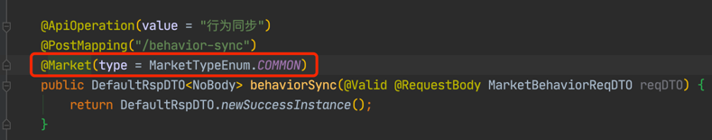
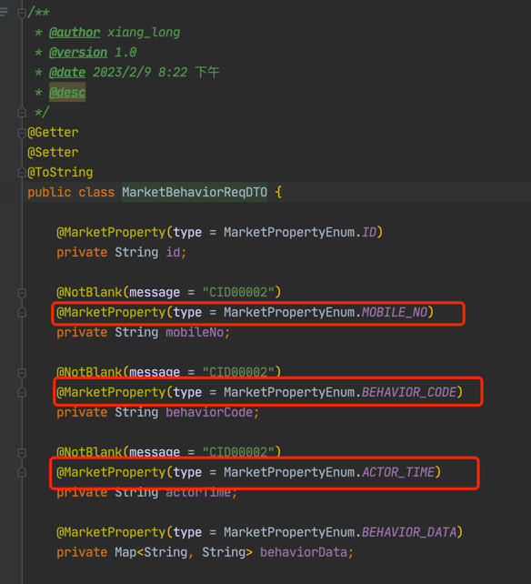
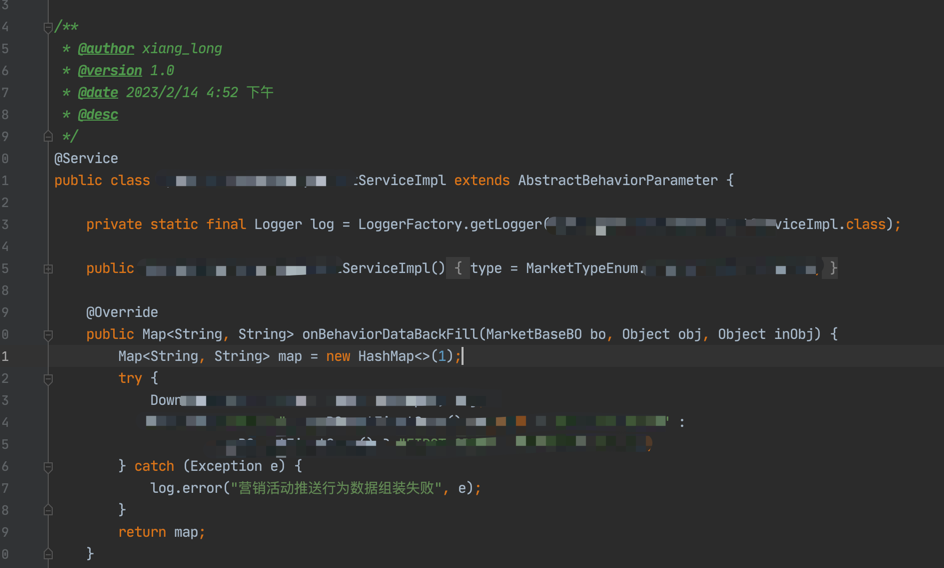

### 营销行为同步插件
    微服务各个模块之间动作同步至营销模块进行运营，此模块通过mq进行异步生产行为对象，营销模块通过mq消费行为对象
    此模块为生产者，通过自定义注解方式将数据异步生产到mq队列进行消费
    
### 使用方法
    配置新增, 默认false
    market.enable=true

#### 自定义注解 注入能力
    自定义注解会在方法返回之前调用MarketAspect进行行为对象组装和生产

    
#### 自定义公共属性赋值
    通过 @MarketProperty 定义自定义公共属性，注解属性赋值更加灵活  

    实现代码参考：MarketAspect.parameterFill方法
    
#### 勾子方法微服务内部参数自定义
    定义BehaviorParameterHandler 的 onBehaviorDataBackFill方法，微服务模块自行实现此方法，进行行为对象的自定义行为赋值
    再实例化MarketAspect时候，通过ObjectProvider方式引入，按照type进行分类顺序执行

#### 消费者
    消费者就自己实现了哈，简单。规则判断可以参考drools和easy-rules等规则引擎框架